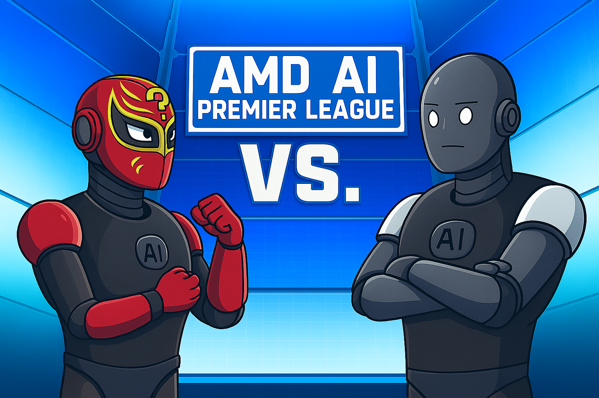

# AMD-AIPL
Hackathon organized at IISC by AMD



## Task:
Here you will be building:
1.  A question agent or Q-agent (e.g., [question_model.py](./agents/question_model.py) & [question_agent.py](./agents/question_agent.py)) that will ask some $N$ puzzle-based questions based on some given [topics](./assets/topics.json). *Note your question agent should output questions in the format specified in [sample_question.json](./assets/sample_question.json)*.
2.  Also, an answer agent or A-agent (e.g., [answer_model.py](./agents/answer_model.py) & [answer_agent.py](./agents/answer_agent.py)) that answer questions asked from question agent. Here too, the format of the output should follow as specified in [sample_answer.json](./assets/sample_answer.json) file.

---

## Tournament Overview
<!-- 🏏  -->
1.  All matches in this tournament will be **1v1** knockout format where two teams, Team-A vs Team-B, will compete with their Q-agent (question agent) and A-agent (answer agent). For simplicity think Q-agent to be bowler and A-agent to be batsman.
2.  Like a cricket match, this would also have two innings:

    -   1st inning:
        *   $N$ Question from the Q-agent (Team-A) and their corresponding $N$ answers from the A-agent (Team-B).
        *   Q-agent score (Team-A): Say, $40$
        *   A-agent score (Team-B): $60$

    -   2nd inning:
        *   $N$ Question from the Q-agent (Team-B) and their respective $N$ responses from the A-agent (Team-A).
        *   Q-agent score (Team-B): Say, $70$
        *   A-agent score (Team-A): $30$
    -   Final Score:
        *   Team-A score $=$ 1st inning Q-agent score $+$ 2nd inning A-agent score $= 40 + 30 = 70$
        *   Team-B score $=$ 1st inning Q-agent score $+$ 2nd inning A-agent score $= 60 + 70 = 130$

    -   Winner: **Team-B** with a score of $130$.
    -   For more info on <b> how SCORING is done</b>, kindly refer to this [cell](#scoring-criteria).

<u>NOTE</u>: In case of **TIE**, we will use some (closed) benchmark questions, we will evaluate your answer agents (A-agent) and rank the teams accordingly.

**Whichever Team's Q-agent fails to generate atleast $50\%$ of `num_questions` (where `num_questions` ranges from $2$ to $1000+$) of the questions correctly (as per [format-checking](#format-overview)) will be automatically disqualified.**<br>
<u>Note</u>: Here $N$ denotes the number of filtered / format-correct questions.


## Guidelines:
<!-- 📋  -->
#### Naming Conventions:
<ol type="a">
    <li>Rename this whole folder as <code>AAIPL_your_IP</code> if not done already. This <code>your_IP</code> will be <code>_</code> separated IPv4 address, no special-characters allowed. Follow the below <a href="#what-you-will-submit">cell</a> for more info</li>
    <li> For Q-agent:
        <ol type="i">
            <li>For Q-agent wrapper <code>.py</code> file: <code>agents/question_agent.py</code>.</li>
            <li>For Q-agent model <code>.py</code> file: <code>agents/question_model.py</code>.</li>
        </ol>
    </li>
    <li> For A-agent:
        <ol type="i">
            <li>For A-agent wrapper <code>.py</code> file: <code>agents/answer_agent.py</code>.</li>
            <li>For A-agent model <code>.py</code> file: <code>agents/answer_model.py</code>.</li>
        </ol>
    </li>
</ol>


#### Format Overview
-   <u>Q-Agent</u>: Given a topic, the Q-agent should generate questions in the specified JSON format:
    ```json
    {
    "topic": "<Topic of the Question>",
    "question": "<full question text>",
    "choices": [
        "A) <choice A text>",
        "B) <choice B text>",
        "C) <choice C text>",
        "D) <choice D text>"
    ],
    "answer": "<correct choice letter only>",
    "explanation": "brief explanation within 100 words for why the answer is correct"
    }
    ```
    from which we will extract **ONLY** the **"Question"** and **"Choices"** keys and feed it to the answer agent. The **"Topic"**, **"Question"**, **"Choices"**, and **"Answer"** will be verified for correctness from an Oracle.
-   <u>A-agent</u>: Given a Question and Choices, A-agent should produce answer in the format of:
    ```json
    {
        "answer": "<correct choice letter only>",
        "reasoning": "brief reasoning within 100 words for why the answer is correct"
    }
    ```
    where we will extract ONLY the **"Answer"** key and compare it with **"Answer"** from the opponent's question.
-   *<u>Remarks</u>: Having explanation and reasoning is a plus. Not having them doesn't disqualify the question or answer being correct.*
    
**<u>Note</u>**: *We will only consider those responses from the Q-agent and the A-agent which follow the above format.*


## RESTRICTIONS
<!-- ⚠️ -->

1.  Kindly don't use any sort of ***RAG (Retrieval Augmented Generation)*** techniques. If found, the submission won't be considered for further evaluations.
2.  **Usage of base models other than what given for Question (i.e., `Qwen3-4B`) and Answer (i.e., again `Qwen3-4B`) agent, will lead to disqualification.**
3.  Do follow the guidelines as mentioned in [What you will submit?](#what-you-will-submit) section.
4.  **<span style="color: red">NO</span> LAST Minute Submission**: The submission deadline is strict. Upload link will expires just one minute before the deadline. So, please make sure you submit your code well in advance.
5.  Any **<span style="color: red">HACKEY</span>** approach or **hard-coding** will lead to disqualification.
    -   E.g., Any hard-coded *adversarial attacks* that make A-agent hallucinates.
6.  **Language Restriction**: ONLY English language is allowed for both Q-agent and A-agent. Any other language will lead to disqualification.
7.  Strictly stay within the `max_tokens` limit as specified in `agen.yaml` & `qgen.yaml`. While other parameters can be changed as per your convenience.
8.  $N$ should be passed as an argument to `question_agent.py`. We'll test for $N=1$. `--num_questions` is the argument.
9.  Ensure **$40\%$** of the questions you generate gets filtered into `questions.json`.


### ALLOWED
<!-- ✅  -->
1.  Participants are encouraged to modify the code scripts (for any sort of training, data construction, inference, such that the above constraints are not overruled).
2.  If you want to add `WANDB_API_KEY` for `wandb` logging do it in add `WANDB_API_KEY=xxxxxxx` before `python -m <script>.py` command. E.g., `!WANDB_API_KEY=xxxxxxx python -m agents.question_agent \`

## Token & Time Limit:
<!-- ⏱  -->
*   Maximum length (e.g., `max_token`) limit for your model response should be within following tokens.
    *   For question-agent (Q-Agent) it is $100$ tokens cumulatively for the content corresponding to [`topic`, `question`, `choices`, and `answer`]. This excludes token count for double quotes as well as string length for topic, question, choices, and answer string it
    *   And the rest is for explanation i.e., $1024-100 = 924$. But within time limit
*   `ckpt` is the folder 📂 which you will place under `AAIPL_XXX_XXX_XXX_XXX`. While `checkpoints` folder 📂 inside `tutorial/` is meant for tutorial.
*   Each question should be generated under `10 secs`. Overall time for 100 questions should be no more than `1000 secs` ~ `17 mins`.
*   Each answer should be generated under `6 secs`. Overall time for 100 answers should be no more than `600 secs` ~ `10 mins`.
*   *Note: We will only consider those questions' and answers' JSON file that remain under the time limit.*

---

## What We Built:

1. **[Dataset Creation](./Dataset_generation/Dataset_generation.ipynb)**  
   Used both publicly available datasets and performed synthetic data generation.

2. **[SFT (Supervised Fine-Tuning)](./AAIPL_129_212_191_47/training_script/answer_trainer.py)**  
   Fine-tuned question and answer models separately using:
   - [question_model.py](./AAIPL_129_212_191_47/agents/question_model.py)
   - [answer_model.py](./AAIPL_129_212_191_47/agents/answer_model.py)

3. **[GRPO (Generative Reinforcement with Policy Optimization)](./AAIPL_129_212_191_47/main.py)**  
   Implemented GRPO for both models with a customised reward function:
   - [question_agent.py](./AAIPL_129_212_191_47/agents/question_agent.py)
   - [answer_agent.py](./AAIPL_129_212_191_47/agents/answer_agent.py)

4. **[Self-Play Mechanism](./AAIPL_129_212_191_47/trainer.py)**  
   Developed a setup where our question model competes with our answer model, improving both iteratively.

5. **[Prompt Engineering](./AAIPL_129_212_191_47/utils/build_prompt.py)**  
   Crafted task-specific prompts to improve logical consistency and answer accuracy.
